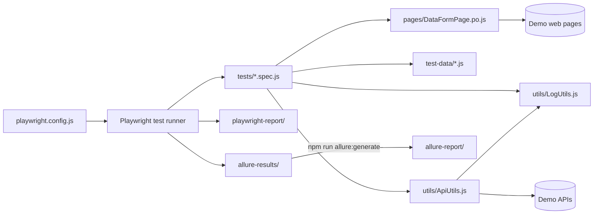

# SimplePageObjectModelProject

Automated tests for public demo websites and APIs, built with Playwright and JavaScript.

## Table of Contents

**Part A — For Everyone**
1. [Overview](#1-overview-everyone)
2. [Why It Matters](#2-why-it-matters-everyone)
3. [What Is Tested](#3-what-is-tested-everyone)
4. [How to Read Test Results](#4-how-to-read-test-results-everyone)
5. [Glossary](#5-glossary-everyone)

**Part B — For Technical Users**

6. [Architecture](#6-architecture-technical)
7. [Prerequisites](#7-prerequisites-technical)
8. [Setup Guide](#8-setup-guide-technical)
9. [Running Tests](#9-running-tests-technical)
10. [Configuration](#10-configuration-technical)
11. [Writing a New Test](#11-writing-a-new-test-technical)
12. [Coding Standards](#12-coding-standards-technical)
13. [CI/CD Integration](#13-cicd-integration-technical)
14. [Debugging & Troubleshooting](#14-debugging--troubleshooting-technical)
15. [Maintenance](#15-maintenance-technical)
16. [Contributing](#16-contributing-technical)
17. [FAQ](#17-faq-everyone)
18. [Open Questions](#18-open-questions-technical)

---

# Part A — For Everyone

## 1. Overview [Everyone]

> **Summary:** This project is a set of automatic checks. A computer runs them to confirm that some websites and services still work.

Think of it as a robot tester. It visits websites and sends requests to online services, just like a person would. Then it checks that the answers are correct. If something is wrong, it reports a failure with details.

Today the project mostly checks **APIs**. An API is the part of a system that other programs talk to. The project also contains a few **UI** (screen) tests that click through a web page. It uses demo sites that are made for practising test automation, not a real company product.

> ### 🚀 Quick Start
> ```bash
> npm ci                          # install project packages
> npx playwright install          # download the test browsers
> npm test                        # run all tests
> npx playwright show-report      # open the HTML report
> ```

## 2. Why It Matters [Everyone]

> **Summary:** Automated tests catch problems early and save hours of repeated manual work.

- **Faster feedback.** All tests finish in under a minute. A person would need much longer to check the same things.
- **Fewer bugs reach users.** Tests run automatically on every change to the `main` branch (see [CI/CD](#13-cicd-integration-technical)).
- **Same check every time.** The robot never skips a step or gets tired.
- **Clear evidence.** Every run produces a report you can share.

## 3. What Is Tested [Everyone]

> **Summary:** Four API checks and two web page checks are active. One form test is switched off.

| ID | Business scenario | Type | Priority* | Status |
|---|---|---|---|---|
| SIT:001 | A user can fill in the contact form (name, email, phone, gender, days) | UI | High | ⏸️ Switched off (commented out) |
| SIT:002 | The shop's product catalogue returns a list of products, each with a price | API | High | ✅ Active |
| SIT:003 | A customer can view the details of one product | API | High | ✅ Active |
| SIT:004 | An admin can add a new product to the catalogue | API | High | ✅ Active |
| SIT:005 | An admin can update an existing product | API | Medium | ✅ Active |
| — | The Playwright website home page shows the right title | UI | Low | ✅ Active (sample test) |
| — | The "Get started" link opens the installation page | UI | Low | ✅ Active (sample test) |

\* Priority is a suggested value. The code does not record a priority.

**Sites used:**
- `automationexercise.com` — demo shop API (SIT:002)
- `api.qaautomationlabs.com` — demo products API (SIT:003–005)
- `testautomationpractice.blogspot.com` — demo form page (SIT:001)
- `playwright.dev` — Playwright's own website (sample tests)

## 4. How to Read Test Results [Everyone]

> **Summary:** After a run you get two reports: Playwright's HTML report and an Allure report. Both show which tests passed or failed and why.

### Opening the reports

| Report | How to open | Best for |
|---|---|---|
| Playwright HTML report | `npx playwright show-report` | Quick look, error details, screenshots |
| Allure report | `npm run allure:report` | Dashboard with charts, timeline, history |

⚠️ **Warning:** Don't double-click `allure-report/index.html`. It gets stuck on "Loading…". Use `npm run allure:open`, or build a single file with `npm run allure:single` that you can open directly.

### What the results mean

| Result | Meaning | What to do |
|---|---|---|
| ✅ Passed | The check worked as expected. | Nothing. |
| ❌ Failed | Something did not match what the test expected. | Read the error message. Contact the owner. |
| ⚠️ Flaky | It failed first, then passed when retried. | Report it. It may hide a real problem. |
| ⏭️ Skipped | The test did not run on purpose. | Nothing, unless it should have run. |

### Evidence attached to results

- **Screenshots** — a picture of the page at the moment a UI test failed.
- **Console output** — each test prints its steps, like the URL called and the status code. You see these under the test in both reports.
- **Traces** — a step-by-step recording of a test. These are only recorded on a retry, which happens in CI only.
- **Videos** — not recorded in this project.

📝 **Note:** API tests have no screenshots because there is no page. Their console output shows the request and response instead.

**Who to contact:** the project owner, `amolbansode16` on GitHub.

## 5. Glossary [Everyone]

| Term | Meaning |
|---|---|
| **Allure** | A tool that turns test results into a visual dashboard report. |
| **API** | A way for programs to talk to each other by sending requests and receiving data. |
| **Assertion** | A check inside a test, such as "the status code must be 200". |
| **CI pipeline** | An automatic process that runs the tests on a server whenever code changes. |
| **Fixture** | A ready-made object Playwright gives each test, such as a browser `page` or an API `request`. |
| **Flaky test** | A test that sometimes passes and sometimes fails with no code change. |
| **GET / POST / PUT** | Request types: GET reads data, POST creates data, PUT updates data. |
| **Headless** | Running a browser without showing its window. This is the default. |
| **JSON** | A text format for data, used in API requests and responses. |
| **Locator** | Instructions that tell Playwright how to find an element on a page. |
| **Page Object** | A file that groups the locators and actions for one page, so tests stay short. |
| **Playwright** | The open-source tool used to write and run these tests. |
| **Request body** | The data sent with a POST or PUT request. |
| **Status code** | A number an API returns: 200 means OK, 201 means created. |
| **Suite** | A group of related tests. |
| **Test** | One automatic check of one scenario. |
| **Test data** | Input values a test uses, kept in separate files. |
| **Trace** | A recording of every step of a test, used for debugging. |
| **UI** | User interface: the screens a person sees and clicks. |
| **Util** | A helper file with reusable functions. |

---

# Part B — For Technical Users

## 6. Architecture [Technical]

> **Summary:** Tests live in `tests/`. They use page objects, test data and utils, and write results to two reporters.

### Folder structure

```
SimplePageObjectModelProject/
├── .github/workflows/
│   └── playwright.yml        # CI: runs tests on push/PR to main or master
├── fixtures/                 # Empty. Reserved for custom fixtures.
├── pages/
│   └── DataFormPage.po.js    # Page object for the demo form page
├── test-data/
│   ├── productData.js        # API URLs (apiUrls) and request body (newProduct)
│   └── userData.js           # Form data: name, email, phone, gender, days
├── tests/
│   ├── dataForm.spec.js      # SIT:002–005 API tests (SIT:001 UI test commented out)
│   └── example.spec.js       # Two sample UI tests against playwright.dev
├── utils/
│   ├── ApiUtils.js           # getRequest / postRequest / putRequest helpers
│   ├── DateUtils.js          # Today, past and future dates as strings
│   └── LogUtils.js           # testStart / testEnd / info console logs
├── Jenkinsfile               # Jenkins pipeline: install, run tests, publish reports
├── playwright.config.js      # Playwright settings and reporters
├── package.json              # Dependencies and npm scripts
└── README.md                 # This file
```

Generated folders (ignored by git): `node_modules/`, `test-results/`, `playwright-report/`, `allure-results/`, `allure-report/`.

### How the parts connect



## 7. Prerequisites [Technical]

> **Summary:** You need Node.js, Java (only for Allure) and Git. No accounts or secrets are needed.

| Tool | Version | Why |
|---|---|---|
| Node.js | 20 or later (tested on v20.8.0) | Runs Playwright |
| npm | Comes with Node.js | Installs packages |
| Java | 8 or later (tested on 1.8.0_144) | Needed only by `allure-commandline` |
| Git | Any recent version | Clone the repository |

| Package | Version (package.json) |
|---|---|
| `@playwright/test` | ^1.63.0 |
| `allure-playwright` | ^3.13.0 |
| `allure-commandline` | ^2.46.1 |
| `@types/node` | ^26.5.0 |

**Access needed:** read access to `https://github.com/amolbansode16/sit_playwright_repo`, plus internet access to the demo sites.

## 8. Setup Guide [Technical]

> **Summary:** Six steps take you from an empty folder to a passing test run.

1. **Clone the repository.**
   ```bash
   git clone https://github.com/amolbansode16/sit_playwright_repo.git
   cd sit_playwright_repo
   ```
   ✔️ Check: running `ls` shows `package.json` and `playwright.config.js`.

2. **Check your tools.**
   ```bash
   node -v
   java -version
   ```
   ✔️ Check: Node prints `v20` or higher. Java prints a version (needed only for Allure).

3. **Install packages.**
   ```bash
   npm ci
   ```
   ✔️ Check: a `node_modules/` folder appears, with no errors.

4. **Install browsers.**
   ```bash
   npx playwright install
   ```
   ✔️ Check: `npx playwright --version` prints `Version 1.63.0`.

5. **Run the tests.**
   ```bash
   npm test
   ```
   ✔️ Check: the last line says `passed` with no failures.

6. **Open the reports.**
   ```bash
   npx playwright show-report
   npm run allure:report
   ```
   ✔️ Check: a browser tab opens with each report.

## 9. Running Tests [Technical]

> **Summary:** Use `npx playwright test` with options to choose what and how to run.

| Goal | Command | What happens |
|---|---|---|
| All tests | `npm test` | Runs every spec file in `tests/` |
| One file | `npx playwright test tests/dataForm.spec.js` | Runs only that file |
| One test by name | `npx playwright test -g "SIT:004"` | Runs tests whose title contains `SIT:004` |
| By tag | `npx playwright test --grep @smoke` | Runs tests tagged `@smoke`. 📝 No tests have tags yet. |
| Specific browser | `npx playwright test --project=chromium` | Only `chromium` is set up |
| Headed mode | `npx playwright test --headed` | Shows the browser window (UI tests only) |
| Debug mode | `npx playwright test --debug` | Opens Playwright Inspector to step through |
| UI mode | `npx playwright test --ui` | Opens an interactive window to pick and watch tests |
| Readable console output | `npx playwright test --reporter=list` | Prints each test and its logs as it runs |
| One test at a time | `npx playwright test --workers=1` | Turns off parallel runs. Logs stay in order. |
| Sharded run | `npx playwright test --shard=1/2` | Runs half the tests. Run `--shard=2/2` elsewhere. |
| Specific environment | Not applicable | 📝 The project has no environment switching. |

💡 **Tip:** Tests run in parallel by default, so console logs from different tests can mix together. Add `--workers=1` to read the logs in order.

### Allure commands

| Command | What happens |
|---|---|
| `npm run allure:generate` | Builds `allure-report/` from `allure-results/` |
| `npm run allure:open` | Serves the report and opens your browser |
| `npm run allure:report` | Builds and opens in one step |
| `npm run allure:single` | Builds one `index.html` that you can open or email |

⚠️ **Warning:** `allure-results/` keeps results from every run until you delete it. Delete it before a run if you want a clean report.

## 10. Configuration [Technical]

> **Summary:** All settings are in `playwright.config.js`. The only environment variable used is `CI`.

### playwright.config.js

| Setting | Value | Effect |
|---|---|---|
| `testDir` | `./tests` | Where Playwright looks for tests |
| `fullyParallel` | `true` | Tests run in parallel, even within one file |
| `forbidOnly` | `!!process.env.CI` | On CI, a forgotten `test.only` fails the run |
| `retries` | `2` on CI, `0` locally | Failed tests retry on CI only |
| `workers` | `1` on CI, default locally | CI runs one test at a time |
| `reporter` | `html` + `allure-playwright` | Writes `playwright-report/` and `allure-results/` |
| `use.baseURL` | Not set (commented out) | Tests use full URLs |
| `use.trace` | `on-first-retry` | Trace recorded only when a test retries |
| `use.screenshot` | `only-on-failure` | Screenshot saved when a UI test fails |
| `use.video` | Not set | No videos |
| Timeouts | Not set | Playwright defaults: 30 s per test, 5 s per `expect` |
| `projects` | `chromium` (Desktop Chrome) | Firefox, WebKit and mobile are commented out |

### Allure reporter options

| Option | Value |
|---|---|
| `resultsDir` | `allure-results` |
| `environmentInfo` | Project, Browser, OS, Node — shown in the report's Environment widget |

### Environment variables

| Name | Purpose | Example | Required |
|---|---|---|---|
| `CI` | Turns on CI behaviour (retries, 1 worker, forbid `.only`) | `CI=true` | No. GitHub Actions sets it automatically. |

📝 **Note:** There is no `.env` file. The `dotenv` lines in the config are commented out.

## 11. Writing a New Test [Technical]

> **Summary:** Put data in `test-data/`, use `ApiUtils` to send requests, use `LogUtils` for logs, and keep only checks in the test.

**Example: add a GET test for product 2.**

1. **Add the URL to test data.** In `test-data/productData.js`:
   ```js
   export const apiUrls ={
       // ...existing URLs
       secondProduct: 'https://api.qaautomationlabs.com/v1/products/2'
   }
   ```

2. **Add the test.** In `tests/dataForm.spec.js`, inside `test.describe`:
   ```js
   test("SIT:006 | Verify second product API",async({request}) =>{
       LogUtils.testStart("SIT:006");

       // Step 1 : Send GET request
       const response = await ApiUtils.getRequest(request, apiUrls.secondProduct);

       // Step 2 : Check status code
       expect(response.status).toBe(200);

       // Step 3 : Verify product details (one product is inside "data")
       const product = response.body.data;
       LogUtils.info("Product :", product);
       expect(product.id).toBe(2);

       LogUtils.testEnd("SIT:006");
   })
   ```

3. **Run it.**
   ```bash
   npx playwright test -g "SIT:006" --reporter=list
   ```
   You should see `1 passed`.

**Project conventions:**
- Test names follow `SIT:<number> | <short description>`.
- Tests start with `LogUtils.testStart` and end with `LogUtils.testEnd`.
- Numbered `// Step N :` comments explain each part.
- `ApiUtils` methods return `{ status, body }`.
- The `api.qaautomationlabs.com` API wraps results in `data`. `automationexercise.com` uses `products`.
- For UI tests, create a page object in `pages/` named `<Name>Page.po.js`.

## 12. Coding Standards [Technical]

> **Summary:** Keep tests short, independent and free of hard waits. Keep data and helpers out of test files.

- **Locators:** Prefer `getByRole`, `getByLabel` or `getByTestId`. `DataFormPage` currently uses XPath and `#id`. These work, but they break more easily when the page changes.
- **Waiting:** Never use fixed waits like `waitForTimeout`. Playwright actions and `expect` wait automatically.
- **No `page.pause()`** in committed tests. It stops the run.
- **Independence:** Each test must pass on its own and in any order. Tests run in parallel.
- **Test data:** Put request bodies and URLs in `test-data/`, not in tests.
- **Helpers:** Put reusable code in `utils/` as `static` methods on a class (see `DateUtils`, `ApiUtils`).
- **Logging:** Use `LogUtils` instead of `console.log`.
- **Naming:** Spec files are `<feature>.spec.js`. Page objects are `<Name>Page.po.js`. Utils are `<Name>Utils.js`.

## 13. CI/CD Integration [Technical]

> **Summary:** GitHub Actions runs every test on pushes and pull requests to `main` or `master`, then uploads the HTML report.

| Item | Detail |
|---|---|
| File | `.github/workflows/playwright.yml` |
| Triggers | Push or pull request to `main` or `master` |
| Runner | `ubuntu-latest`, Node `lts/*`, 60-minute timeout |
| Steps | `npm ci` → `npx playwright install --with-deps` → `npx playwright test` |
| Artifact | `playwright-report` folder, kept for 30 days |

**Finding the report:** open the run on GitHub's **Actions** tab, then download `playwright-report` under **Artifacts**. Unzip it and run `npx playwright show-report <folder>`.

**How failures show up:** the run gets a red ❌ on the commit or pull request.

📝 **Note:** GitHub Actions does not build or upload the Allure report yet.

### Jenkins

The `Jenkinsfile` in the project root runs the tests on a Windows Jenkins agent.

| Stage | What it does |
|---|---|
| Install | `npm ci` and `npx playwright install chromium` |
| Clean old results | Deletes `allure-results` from the previous build |
| Run tests | `npx playwright test` with `CI=true` |
| Post (always) | Archives `playwright-report/` and publishes the Allure report |

**One-time Jenkins setup:**
1. Install the **Allure** plugin: *Manage Jenkins → Plugins → Available plugins*.
2. Add the Allure tool: *Manage Jenkins → Tools → Allure Commandline → Add*. Tick **Install automatically**.
3. Create a job: *New Item → Pipeline*.
4. Under **Pipeline**, choose **Pipeline script from SCM** → **Git**.
5. Enter the repository URL and branch, for example `*/main`. Keep **Script Path** as `Jenkinsfile`.
6. Click **Build Now**.

✔️ Check: the build page shows an **Allure Report** link, and `playwright-report` appears under build artifacts.

⚠️ **Warning:** Jenkins reads the `Jenkinsfile` from GitHub. Push your changes before you build.

## 14. Debugging & Troubleshooting [Technical]

> **Summary:** Use the trace viewer, Inspector and codegen to see what went wrong. The table lists common errors.

| Tool | Command | Use it to |
|---|---|---|
| Trace viewer | `npx playwright test --trace on` then `npx playwright show-trace test-results/<folder>/trace.zip` | Replay every step of a test |
| Inspector | `npx playwright test --debug` | Step through a test line by line |
| Codegen | `npx playwright codegen https://testautomationpractice.blogspot.com/` | Record clicks and get locator code |

💡 **Tip:** Locally `retries` is `0`, so traces are never recorded. Add `--trace on` when you need one.

### Common errors

| Error | Likely cause | Fix |
|---|---|---|
| `TypeError: products is not iterable` | The response holds one object, not a list (for example `/products/1`) | Read `response.body.data` as a single object |
| `Expected path: "..."` from `toHaveProperty` | The field is not in the API response | Print the response with `LogUtils.info` and check the field name |
| `Total products : undefined` | Wrong key: this API uses `data`, the other uses `products` | Use the key that matches the API |
| `No tests found` | The `-g` text doesn't match a test title | Check the exact title in the spec file |
| Allure report stuck on "Loading…" | `index.html` opened directly from disk | Use `npm run allure:open` or `npm run allure:single` |
| `allure: command not found` / Java error | Java is missing | Install Java 8+ and check `java -version` |
| `Executable doesn't exist` | Browsers not installed | Run `npx playwright install` |

### Flaky tests

1. Run the test several times: `npx playwright test -g "SIT:002" --repeat-each=5`.
2. Look for missing awaits, order dependencies between tests, or slow external APIs.
3. These tests call public demo APIs. A failure may mean the site is down, not that the test is wrong. Open the URL in a browser to check.

## 15. Maintenance [Technical]

> **Summary:** Update packages regularly, fix locators when pages change, and clean generated folders.

- **Update Playwright and browsers:**
  ```bash
  npm install -D @playwright/test@latest
  npx playwright install
  ```
  Then run `npm test` to confirm nothing broke.
- **Update Allure:**
  ```bash
  npm install -D allure-playwright@latest allure-commandline@latest
  ```
- **Locators after UI changes:** Update them only in the page object (`pages/`). Tests don't need to change.
- **API changes:** Update URLs and request bodies in `test-data/productData.js`.
- **Clean generated output:**
  ```bash
  rm -rf test-results playwright-report allure-results allure-report
  ```
- **Test data cleanup:** Not needed. The demo API does not seem to save created products (it returns id 61 every time).

## 16. Contributing [Technical]

> **Summary:** Work on a branch, open a pull request to `main`, and make sure CI passes.

- **Branch names:** follow the existing pattern, for example `sit/sit-001-utils`.
- **Commit messages:** use a prefix, as in the history, for example `test: added code for utils`.

**PR checklist:**
- [ ] All tests pass locally with `npm test`.
- [ ] New data is in `test-data/`, new helpers are in `utils/`.
- [ ] Tests use `LogUtils` and the `SIT:<n> | <name>` title format.
- [ ] No `test.only`, `page.pause()` or commented-out code left behind.
- [ ] README updated if you added commands, folders or settings.

**Review:** at least one reviewer approves, and the GitHub Actions check is green.

## 17. FAQ [Everyone]

**Do I need to install anything to read a report?**
No. Ask for the `index.html` made by `npm run allure:single`, and open it in any browser.

**Why are there two reports?**
The HTML report is Playwright's built-in report. Allure adds charts, a timeline and an environment summary.

**Does this test our real product?**
No. It tests public demo sites used for learning test automation.

**Do the tests change real data?**
SIT:004 and SIT:005 send create and update requests to a demo API. It appears not to save them.

**Why did a test fail when nobody changed anything?**
The demo sites are outside our control. If one is slow or down, tests fail. Run again, and open the URL to check.

**How long does a full run take?**
Usually under 30 seconds locally.

**Can I run the tests in Firefox or Safari?**
Not yet. Those projects are commented out in `playwright.config.js`. Uncomment them to enable.

**Where do I put a new request body?**
In `test-data/productData.js`, then import it in your test.

**Why are my console logs mixed up?**
Tests run in parallel. Add `--workers=1`.

**Why is SIT:001 not running?**
It is commented out in `tests/dataForm.spec.js`. See [Open Questions](#18-open-questions-technical).

## 18. Open Questions [Technical]

> **Summary:** Things that could not be confirmed from the code, or look like issues.

1. **SIT:001 is commented out.** Is it planned to come back? It also calls `page.pause()`, which would stop CI.
2. **Bug in `DataFormPage.selectGender`:** it compares `gender.toLowerCase === 'female'` without `()`. "Female" is never selected.
3. **`DataFormPage.verifyUserDetails` uses `expect`** but the file does not import it. Calling it would throw an error.
4. **Suite name:** `test.describe("User Form Tests")` contains only API tests. Should it be renamed or split?
5. **`fixtures/` is empty.** Is it planned for custom fixtures?
6. **`example.spec.js`** is Playwright's sample file. Keep it or delete it?
7. **Allure in CI:** should the workflow build and upload the Allure report too?
8. **Allure Environment widget:** `environmentInfo` is set in the config, but it was not confirmed that the values appear in the generated report.
9. **Owners and contacts:** only the Git user `amolbansode16` is known. Is there a team channel for failures?
10. **Priorities** in [What Is Tested](#3-what-is-tested-everyone) are suggestions. Please confirm.

---

### Document Info

| | |
|---|---|
| Last updated | 2026-10-06 |
| Playwright version documented | 1.63.0 |
| Owner | amolbansode16 |
